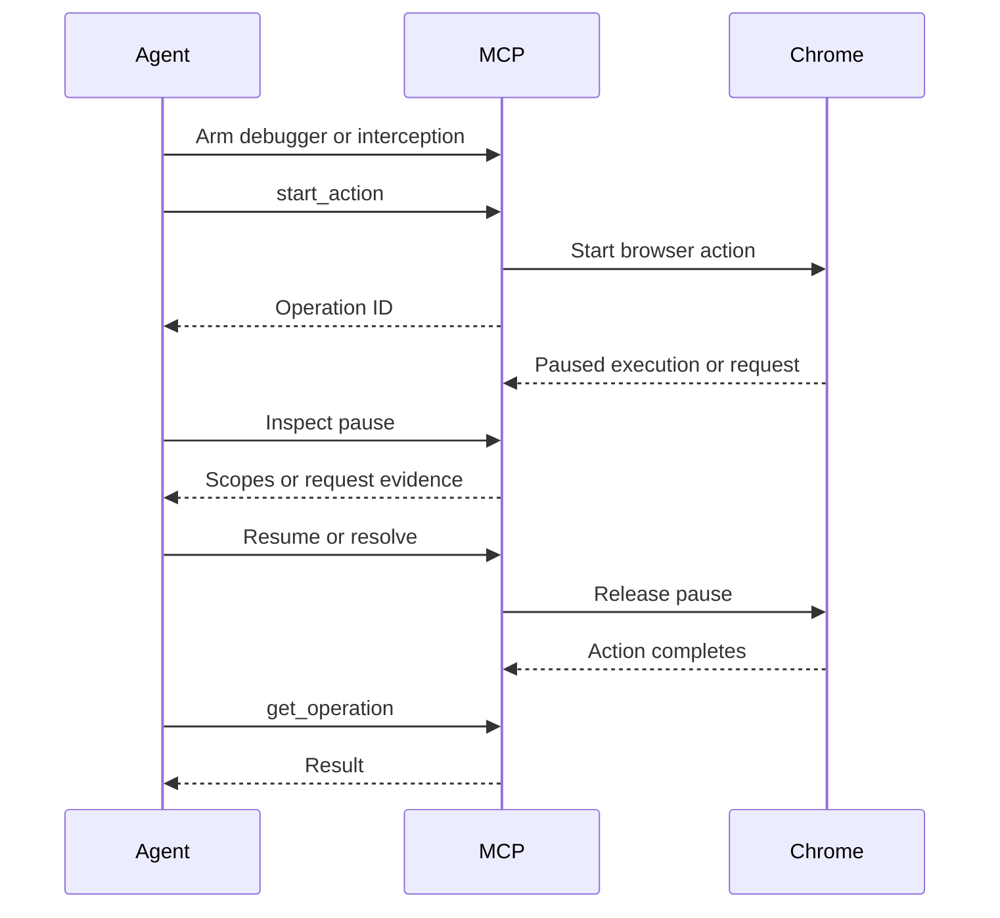

# Website and API investigation

Ghostframe helps agents connect website actions to frontend API behavior.
Start with passive capture.
Use runtime access or controlled pauses when the returned evidence is insufficient.

Each tool exposes a small browser operation.
Use the captured files for payload comparisons, source searches, and client implementation.
Those analysis tasks can run outside the browser.

This guide uses tool names and JSON parameters.
The MCP client supplies the tool-call transport.
See [Tool reference](tool-reference.md) for full schemas.

## Choose the operation

| Need                                                   | Tool                                            |
| ------------------------------------------------------ | ----------------------------------------------- |
| Keep traffic after navigation or tab closure           | `start_capture`, `read_capture`, `stop_capture` |
| Observe a future network event                         | `arm_network_wait`, `read_network_wait`         |
| Change the proxy without restarting Chrome             | `set_proxy`, `get_proxy`                        |
| Change an actual application request                   | `arm_interception`, `resolve_interception`      |
| Replace a response before the application receives it  | Response-stage interception                     |
| Run an action that can pause                           | `start_action`, `get_operation`                 |
| Find the listeners on a button                         | `get_event_listeners`                           |
| Inspect a runtime object without converting it to JSON | `runtime_evaluate`, `inspect_handle`            |
| Call the actual function with its original closure     | `call_handle`                                   |
| Select a frame or worker                               | `list_targets`, `runtime_evaluate`              |
| Read paused variables or generated script source       | `debugger_control`                              |
| Read scoped cookies and storage                        | `session_cookies`, `inspect_storage`            |

## Capture a website flow

1. Open the website with `new_page`.
2. Call `start_capture`.

   ```json
   {"maxBodyBytes": 5242880, "maxTotalBytes": 104857600}
   ```

3. Save the returned `captureId` and `directory`.
4. Take a snapshot with `take_snapshot`.
5. Perform one browser action.
6. Call `read_capture` with the saved capture ID.

   ```json
   {"captureId": "capture-1", "cursor": 0, "limit": 100}
   ```

7. Save the returned `nextCursor`.
8. Read relevant body files through their `bodyFilePath` values.
9. Repeat the browser action and capture read for the next step.
10. Call `stop_capture` when the flow is complete.

Pass `pageId` to `start_capture` to limit collection to one page.
Omit it to collect current pages and future tabs.
Pass `directory` to select the parent directory for a unique capture folder.
The default location is the system temporary directory.

The capture folder contains `events.jsonl` and a `bodies` directory.
Journal records have sequence numbers and capture-wide request IDs.
WebSocket and EventSource payload records use message IDs to identify their message.
Body files do not change after they are written.

Captures remain readable after navigation, tab closure, and capture stop.
The MCP process keeps the capture ID registry.
After that process exits, use the saved directory to read the files directly.

Action records contain start and end markers.
Use their times to locate related traffic.
Do not infer a causal relationship from time alone.

### Header values

Network inspection, capture, and interception retain collected header values in full.
This includes authentication, cookie, and custom headers.
Bodies and URL query parameters also retain their collected values.
These results can contain credentials or session data.

Paused interception headers reflect Chrome's Fetch event.
That event can omit `Set-Cookie` even when Chrome has processed the cookie.
Use passive capture extra-info events for the missing network header evidence.
Returning collected values in full does not guarantee that every browser event contains every header.

### Network coverage and fidelity

Passive capture uses existing page primary CDP sessions.
It does not enable a new Debugger or Runtime domain.
Independent workers, out-of-process frames, and browser background traffic can be absent.
The journal records known target attachment gaps.
Target listing and worker evaluation do not extend passive network coverage.

Capture begins when `start_capture` runs.
Earlier traffic and transient earlier code cannot be recovered from that capture.
Keep collection active before the interaction that matters.

Header maps are normalized representations.
Duplicate values can be combined.
Original wire order is not guaranteed.
Raw HTTP/1 response-header text is retained when Chrome supplies it.
HTTP/2 and QUIC can lack that raw text.

Extra-info events can arrive before or after request and response events.
Keep capture active until the required header evidence appears in `read_capture`.
Stopping flushes observed records and pending body reads; it does not wait for future extra-info events.
Some requests have no extra-info event.
Redirect hops reuse a CDP request ID.
The journal preserves extra-info records and marks their hop association as unresolved.
Do not join them to a hop solely by arrival time.

Bodies contain the decoded data returned by CDP.
They do not preserve TLS records or HTTP compression bytes.
Multipart upload file content can be unavailable.
Redirect response bodies can also be unavailable.

Each capture has per-body and total byte limits.
The default limits are 5 MiB per body and 100 MiB per capture.
Terminal gap records can exceed the total limit slightly.
Inspect `bodyStatus` and `coverage_gap` records when data is missing.
Inspect the capture summary's `error` field for file-write failures.

### Streaming traffic

WebSocket handshake and message capture use regular Network events.
EventSource messages also use regular Network events.
The journal stores payloads in files with message metadata.
WebSocket message events do not preserve wire fragmentation.

For fetch response chunks, start a capture with:

```json
{"streaming": true}
```

Fetch streaming uses the experimental `Network.streamResourceContent` command.
The recorder saves buffered content and later chunks.
Unsupported commands and request-specific failures produce gap records.
Use those records to assess coverage on the installed Chrome version.

## Observe a future request or response

1. Call `arm_network_wait` before the browser action.

   ```json
   {
     "url": "/api/search",
     "method": "POST",
     "phase": "response",
     "timeout": 30000
   }
   ```

2. Save the returned `observationId`.
3. Perform the action.
4. Call `read_network_wait` with that observation ID.

The arm call returns immediately.
It does not hold the browser tool queue.
The result becomes `matched`, `timed_out`, or `cancelled`.
A matched result contains event metadata without header or body values.

The URL match is a substring match.
The observation sees future events only.
An observation for a closed page is cancelled.
Use a capture when you also need the request body or response body.

## Change the proxy after launch

1. Call `get_proxy` to inspect the regular profile settings.
2. Call `set_proxy` with the new route.

   ```json
   {
     "mode": "proxy",
     "server": "http://proxy.example.com:8888",
     "username": "user",
     "password": "pass",
     "connectionPolicy": "new_connections"
   }
   ```

3. Call `get_proxy` to inspect the effective settings.
4. Open a route-check page if you need to verify the observed exit IP.

To select direct access, call `set_proxy` with `{"mode":"direct"}`.
Direct mode does not accept proxy credentials or a bypass list.

Proxy control uses a managed extension and native Chrome settings.
It keeps existing tabs, cookies, storage, and loaded application state.
It does not replace Chrome's destination TLS stack.

The scope is the regular profile.
Explicit proxy overrides in isolated contexts can use a different route.
Chrome policy or another extension can prevent the change.
Unsupported extension control produces an error.

Existing connections can continue on the old route.
This includes tunnels, sockets, and long-lived streams.
The tool cannot force them to move.
`disconnect_existing` fails before changing settings.
The tool does not verify connectivity or control UDP and WebRTC routing.

Chrome can retain proxy authentication for a host and port.
Ghostframe rejects changed or removed credentials for a previously configured endpoint.
Use another endpoint or restart Chrome to change those credentials.
Authenticated SOCKS proxies are unsupported.

## Change a real request

1. Call `arm_interception` with a narrow request pattern.

   ```json
   {"urlPattern": "*/api/search*", "stage": "request", "method": "POST"}
   ```

2. Save the returned `interceptionId`.
3. Trigger the request with `start_action`.

   ```json
   {"action": "click", "uid": "1_4"}
   ```

4. Save the returned `operationId`.
5. Call `read_interception` until its state is `paused`.
6. Call `resolve_interception` with the mutation.

   ```json
   {
     "interceptionId": "<returned ID>",
     "action": "continue",
     "postData": "{\"query\":\"changed\"}"
   }
   ```

7. Call `get_operation` with the operation ID to inspect the action result.

The mutation affects traffic that the application actually produced.
The application can first construct headers, signatures, and payloads through its existing code.
The pause occurs before the selected traffic proceeds.

The `headers` parameter replaces the full header set.
It does not merge individual headers.
Supply each header as `Header-Name: value`.
Duplicate names are supported.
Request overrides do not automatically apply to later redirect hops.

Interception uses a bounded one-shot rule.
Its default deadline is 30 seconds.
At the deadline, paused traffic continues unchanged if its body stream has not been consumed.
Use `cancel` to release the rule early.

Interception changes timing and can affect the result under investigation.
Avoid overlapping request interception systems on the same page.
Navigation allowlists and Puppeteer authentication can also use interception.

## Replace a response

1. Arm an interception with `stage: "response"`.
2. Trigger the request with `start_action`.
3. Read the interception until it is `paused`.
4. Start a body read with `read_interception` and `includeBody: true` if required.
5. Poll the same call until its body status is complete, truncated, or failed.
6. Call `resolve_interception` with the replacement response.

   ```json
   {
     "interceptionId": "<returned ID>",
     "action": "fulfill",
     "status": 200,
     "headers": ["Content-Type: application/json"],
     "body": "{\"enabled\":false}",
     "bodyEncoding": "utf8"
   }
   ```

7. Read the operation result with `get_operation`.
8. Inspect the next captured requests.

The application receives the substituted response.
This lets you test which response fields affect later steps.
Body reads return progress immediately so an endless response cannot hold the tool queue.
Completed bodies use base64 encoding.
The read retains at most 1 MiB and reports truncation when the limit is exceeded.

Reading a body takes control of the response stream.
The browser cannot continue that consumed stream as it was.
If the complete body is retained, `continue` or `cancel` can deliver a reconstructed original response.
If the body remains incomplete, `cancel` or deadline expiry aborts the request.
Use `fulfill` to supply a replacement response, including after truncation.
Inspect `releaseAction` to distinguish continued traffic, reconstructed traffic, and an aborted request.

## Inspect runtime objects and functions

1. Call `list_targets` to obtain target and frame IDs.
2. Call `runtime_evaluate` in the relevant frame or worker.

   ```json
   {
     "pageId": 1,
     "world": "main",
     "function": "() => window.appClient",
     "returnMode": "handle"
   }
   ```

3. Save the returned handle.
4. Call `inspect_handle` to read its properties.
5. Inspect returned property handles as required.
6. Call `release_handles` when the investigation is complete.

Pages default to the isolated world.
Use the main world for application globals and functions.
Workers have only a main world.
Supply either `pageId` or `targetId`.

Property inspection returns getter and setter handles without invoking them.
Chrome can expose internal properties, private properties, and function scope objects.
Their visibility depends on the engine version and optimization state.
Some variables are unavailable.
Retained objects can affect garbage collection and timing.

Handles belong to a target, frame, and world.
Argument handles must belong to the same location as the function call.
Handles expire after navigation, frame replacement, target destruction, or release.
The retained-handle limit is 1,000.

`call_handle` invokes the actual retained function.
Its original closure remains attached.
Use `thisHandle` when the function requires a receiver.
The `args` field is a JSON string containing value or handle entries:

```json
{
  "handle": "handle-2",
  "thisHandle": "handle-1",
  "args": "[{\"value\":\"example\"}]",
  "returnMode": "value"
}
```

Use `start_action` with `action: "call_handle"` when the invocation can hit a breakpoint.
Copying function source text does not preserve its closure.

### Find an event handler

1. Take a current accessibility snapshot.
2. Call `get_event_listeners` with the element UID.
3. Inspect the returned handler or original-handler handle.
4. Follow exposed properties and internal scope handles when available.

Ancestor inspection defaults to enabled.
It includes delegated listeners on ancestors, the document, and the window.
A framework can expose its dispatcher instead of the application callback.
Listener source coordinates use zero-based line and column numbers.
This operation does not enable the Debugger domain.

## Use a scoped debugger

The browser action runs separately from the foreground tool queue.
This lets another call inspect and release its pause.



1. Start a debugger session on the target.

   ```json
   {"action": "start", "pageId": 1, "timeoutMs": 60000}
   ```

2. Add the required breakpoint with `debugger_control`.

   ```json
   {"action": "breakpoint", "pageId": 1, "kind": "xhr", "url": "/api/search"}
   ```

3. Trigger the flow with `start_action`.
4. Read `debugger_control` with `action: "status"`.
5. Inspect the returned paused call frames and scope handles.
6. Evaluate a paused expression if required.

   ```json
   {
     "action": "evaluate",
     "pageId": 1,
     "callFrameId": "<current paused frame>",
     "expression": "requestBody",
     "returnMode": "value"
   }
   ```

7. Resume execution with `action: "resume"`.
8. Read the action result with `get_operation`.
9. Stop the debugger with `action: "stop"`.

Available breakpoint kinds are `source`, `function`, `xhr`, and `event`.
Source breakpoints use zero-based coordinates.
Function breakpoints use a retained function handle from the same session.
XHR breakpoints also apply to matching fetch calls.

Use `action: "scripts"` to list known scripts.
Use `action: "source"` with a script ID to obtain generated source.
This can expose code that is not available as a normal downloaded URL.
Earlier transient or collected scripts can be missing.
The script list is limited to 10,000 entries.

The debugger deadline defaults to 60 seconds.
The maximum deadline is 300 seconds.
At the deadline, the session resumes and stops.
Debugger use changes runtime behavior and timing.
It is not guaranteed to preserve stealth.

### Action state

`start_action` returns before the browser action completes.
This keeps the tool queue available for pause inspection and release.
It supports navigation, clicking, filling, typing, key presses, evaluation, and retained function calls.
`get_operation` reports `running`, `completed`, `failed`, `timed_out`, or `cancelled`.

An observation deadline does not necessarily stop JavaScript.
Check `executionMayContinue` after a timeout.
Release the debugger or interception pause when one remains active.
Use `cancel_operation` when explicit termination is required.

Navigation cancellation stops loading.
Releasing a retained function handle does not prevent cancellation of its active action.
Other action cancellation terminates JavaScript on the execution target and can stop unrelated scripts there.
The manager permits one unfinished action per page or worker target.
Completed operation records can be evicted after 128 actions.

## Inspect privileged browser state

1. Call `session_cookies` with `action: "list"` for the relevant page.
2. Call `inspect_storage` in the relevant frame.

   ```json
   {"pageId": 1, "kind": "indexeddb"}
   ```

3. Read the returned database names.
4. Query a database with `databaseName`.
5. Query a store with `objectStoreName` and a page size.
6. Inspect returned object handles when required.

Cookie access uses the page's browser context.
It includes HttpOnly cookies and the partition metadata supplied by Chrome.
Cookie `set` and `remove` actions change browser state.
Removal matches the exact name, domain, path, and partition.

Storage inspection uses the frame's storage key by default.
That key identifies partitioned storage more precisely than the origin alone.
The supported storage kinds are local storage, session storage, IndexedDB, and CacheStorage.
Worker targets are not accepted for this storage query.

To inspect CacheStorage, first query `kind: "cache"`.
Use the returned cache ID to request entries.
Supply `requestURL` to request a cached response.
Cached variants can require further inspection of their request headers.

## Current boundaries

The tools reuse public CDP capabilities and Puppeteer internals where necessary.
They do not require reverse engineering Chrome binaries.
There is no automatic whole-browser traffic archive or NetLog recorder.
There is no automatic source-map reconstruction, signing-algorithm extraction, or API-client generator.

Use the captured files and runtime evidence for those investigations.
Treat missing evidence as a capture limit until you verify the relevant behavior.
Keep experimental commands and debugger sessions explicit.
